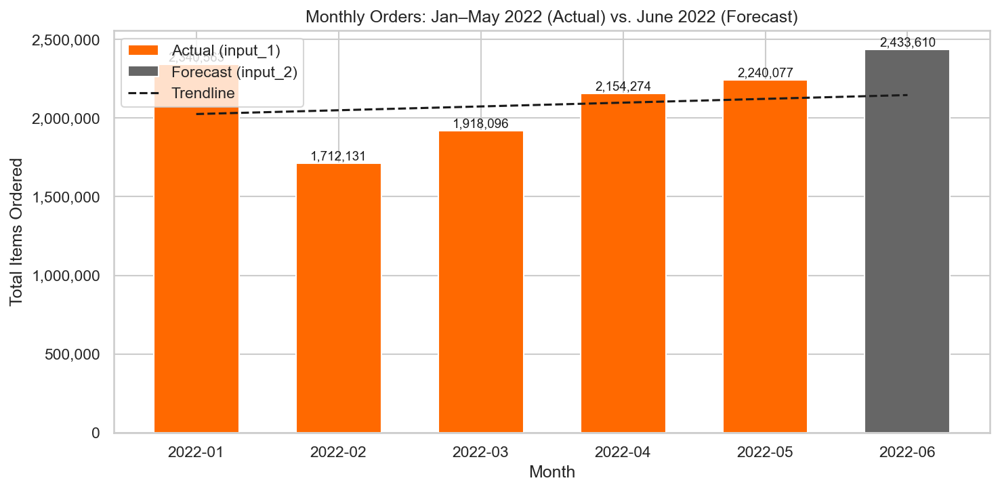
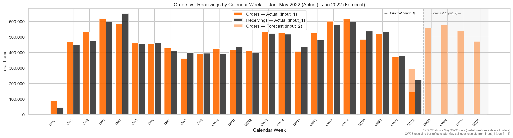
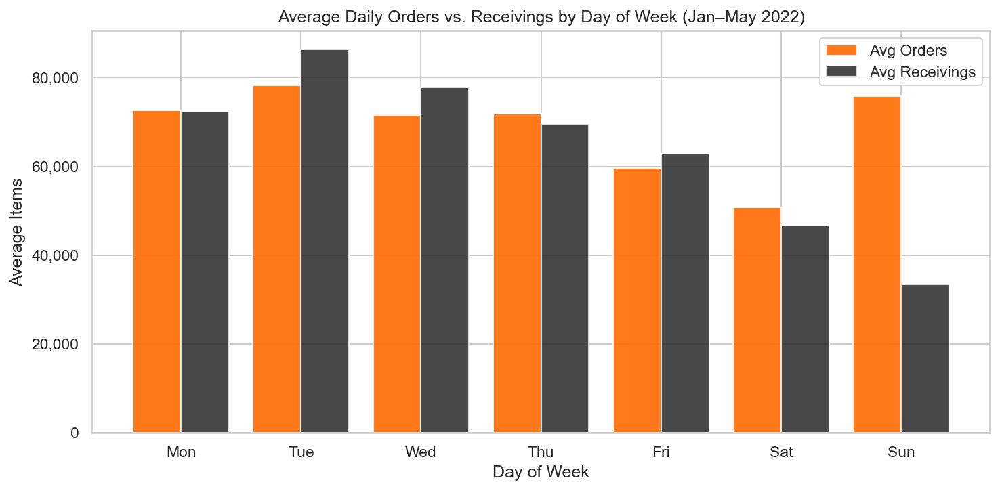
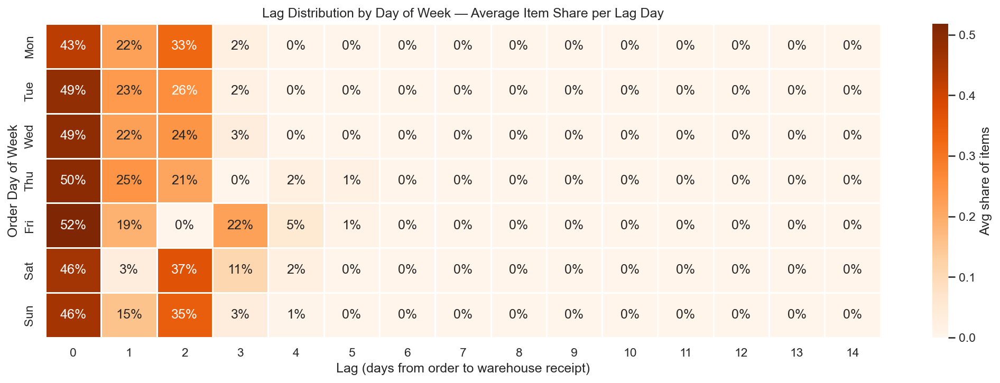
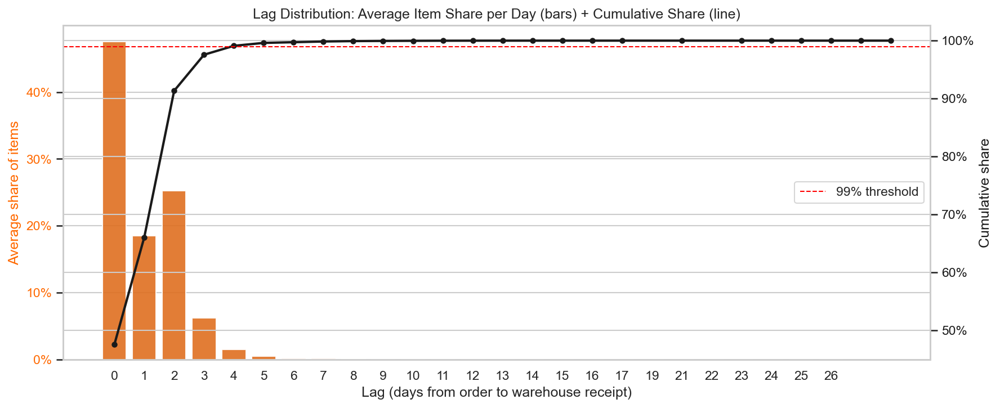
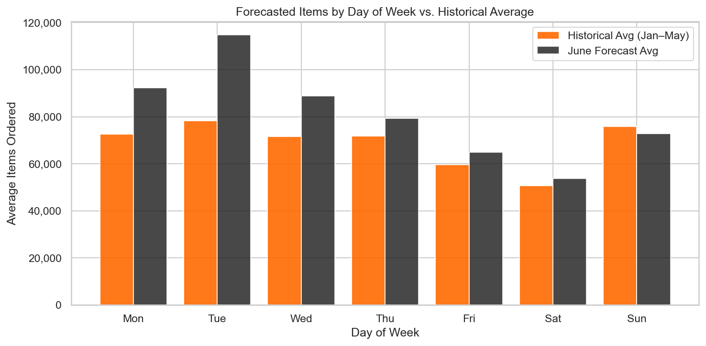
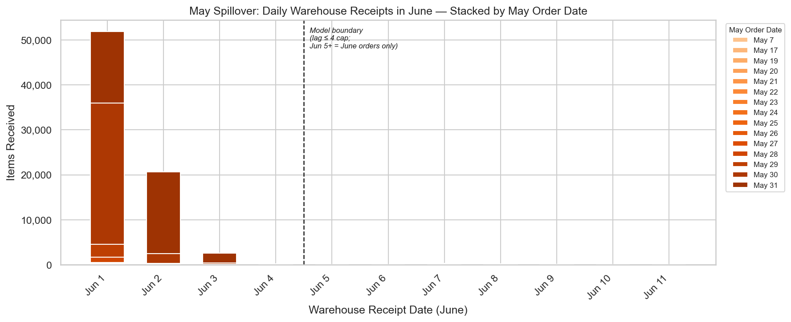
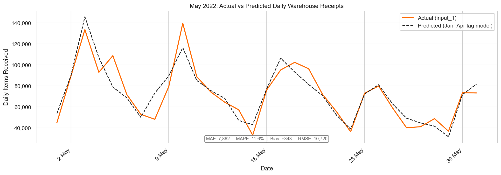
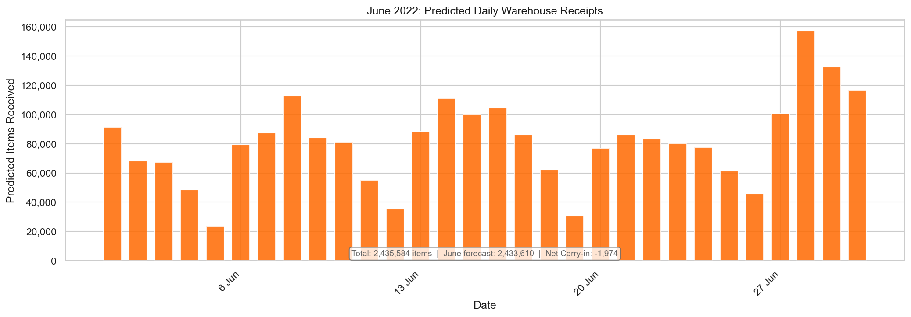

# Zalando Network Planning — Warehouse Inbound Forecast Report

**Project:** Logistics Network Planning Case Study  
**Scope:** Inbound operations, single warehouse  
**Output:** Daily warehouse receipt forecast, June 1–30, 2022

---

## Executive Summary

This report presents a daily warehouse receipt forecast for June 2022, produced for Zalando's Schönefeld inbound operations. Using 5 months of historical order-to-receipt data (Jan–May 2022), a day-of-week segmented lag distribution was fitted to capture how long orders take to physically arrive at the warehouse — a pattern that varies materially by day, particularly on weekends. This distribution was applied to the business-provided June order forecast to produce a daily receipt volume prediction for each of the 30 days in June. Validated on a May hold-out set, the model achieves a **MAPE of 11.6% and near-zero bias**, confirming it captures the operational timing pattern without systematic over- or under-forecasting. The June forecast totals 2,435,582 items, with Mondays consistently peaking due to weekend spillover accumulation and a notable receipt spike around Jun 28–30 driven by a high-order day in the sales forecast.

## 1. Goal

Predict **daily warehouse receipt volumes for June 2022** by learning order-to-receipt lag patterns from five months of historical data and applying them to a June order forecast. The output supports warehouse staffing and inbound capacity planning.

The model is a **distribution mechanism**: the total June demand level comes directly from the business-provided sales forecast (input_2); the model adds the operational timing pattern on top by distributing each day's orders across future receipt dates according to historical lag profiles.

---

## 2. Data Available

### input_1 — Historical Data
| Attribute | Value |
|-----------|-------|
| Rows | 1,763 |
| Columns | 6 |
| Order date range | Jan 1 – May 31, 2022 (151 unique dates) |
| Receipt date range | Jan 1 – Jun 11, 2022 |
| Key columns | `date_order`, `day_of_week_order`, `date_wh_receive`, `day_of_week_wh_receive`, `CW`, `items` |
| Day-of-week encoding | 1 = Monday, 7 = Sunday |

Each row represents items from a given order date received at the warehouse on a given receipt date. Multiple rows per order date capture the spread of receipts across different lag days.

### input_2 — Sales Forecast
| Attribute | Value |
|-----------|-------|
| Rows | 30 |
| Columns | 3 |
| Date range | Jun 1–30, 2022 (all 30 days) |
| Key columns | `date_order`, `day_of_week_order`, `Forecated_items` |
| Total forecast | 2,433,610 items |

---

## 3. Required Output

A CSV file (`202402_Data - Case Study - Analyst Network Planning_vShared - Expected_output.csv`) with 30 rows covering Jun 1–30, 2022:

| Column | Description |
|--------|-------------|
| `date_wh_receive` | Date items arrive at the warehouse |
| `items` | Predicted daily receipt volume (integer) |

---

## 4. Project Outline

The analysis is structured in four sections in `analysis.ipynb`:

```
1. Load Data
2. Data Quality Checks
   └── input_1: outlier detection, imputation, share sums
   └── input_2: coverage, encoding consistency, outlier review
3. Data Exploration
   ├── 3.1 Orders by Month (Trendline)
   ├── 3.2 Orders vs. Receivings by Calendar Week
   ├── 3.3 Orders vs. Receivings by Day of Week
   ├── 3.4 Outliers in Historical Receiving Data
   ├── 3.5 Lag Distribution Analysis
   ├── 3.6 Forecasted Items by Day of Week
   └── 3.7 May Spillover Quantification
4. Forecast Generation
   ├── 4.1 Build Lag Distribution (Jan–Apr train set)
   ├── 4.2 Validate on May
   ├── 4.3 Rebuild Lag Distribution (full Jan–May)
   └── 4.4 Apply to June + Write Output
```

---

## 5. Data Quality Checks

### input_1 — Historical Data

| Check | Result |
|-------|--------|
| Missing values | None |
| Duplicate rows | None |
| Negative / zero items | None |
| Share sums per order date | All exactly 1.0 — no data gaps |
| Outlier detection (IQR) | Flagged 326 rows (~18.5%) — rejected as unsuitable due to structural right-skew |
| Outlier detection (magnitude gap) | **1 anomaly** — May 29 (items = 27,533,000; 367.9× next highest value) |

**Outlier treatment:** Row 1731 (May 29) was identified as a data entry error — a realistic same-day receipt for a large retailer is 50,000–75,000 items, not 27.5 million. Imputed with the **median lag-0 value for Sunday orders (32,161)** to preserve the realistic shape of May 29's lag distribution. After imputation, May 2022 total orders: ~2.24M (previously inflated to ~29.7M).

**Why IQR was rejected:** The dataset is structurally right-skewed — Q1 = 19 (driven by tiny trickle amounts at long lags) and Q3 = 5,423. This produces an upper bound of 13,529, incorrectly flagging legitimate high-volume records. A magnitude gap check is more appropriate for data entry error detection.

### input_2 — Sales Forecast

| Check | Result |
|-------|--------|
| Missing values | None |
| Negative / zero items | None |
| Date coverage | All 30 June dates present |
| Day-of-week encoding | Consistent with input_1 (1 = Mon, 7 = Sun) |
| Weekday coverage | All 7 days represented (4–5 occurrences each) |
| Outlier (IQR) | Jun 28: 183,785 items (IQR upper bound: 142,837) — 1.3× bound |

**Jun 28 retained as-is:** The 1.3× exceedance is minor compared to the 367.9× gap seen in input_1. No evidence of a data entry error. As a business-provided forecast input, it is retained and likely reflects a planned promotion or end-of-month sales event. It propagates naturally as a receipt spike around Jun 28–30 in the output.

---

## 6. Key Observations from Exploration

### 6.1 Orders by Month

Monthly order volumes show an upward trend Jan–May 2022, with a seasonal dip in February (shortest month). Month-on-month growth: +12% (Mar), +12% (Apr), +4% (May). The June forecast (2.43M) sits above the trendline at ~8.6% above May — consistent with the growth trajectory and likely reflects seasonal demand acceleration heading into summer.



### 6.2 Orders vs. Receivings by Calendar Week

Orders and receivings track closely for most historical weeks, confirming the lag is short and concentrated within the same or next week. Notable patterns:
- **CW3–CW4 spike:** post-Christmas/January sales effect
- **CW7–CW12 dip:** February seasonal trough
- **CW22 partial week:** order bar artificially small (May 30–31 only, 2 days)
- **CW23:** late-May spillover arrivals (Jun 6–11) visible alongside Jun forecast orders

June forecast (CW23–26) shows higher volumes than comparable historical weeks, consistent with the ~8.6% demand uplift.



**Model implication:** Calendar-week alignment is stable across all 22 weeks — no CW-level segmentation of the lag distribution is warranted.

### 6.3 Orders vs. Receivings by Day of Week

| Day | Avg Orders | Avg Receivings | Pattern |
|-----|-----------|----------------|---------|
| Mon–Thu | ~70–78k | ~70–87k | Broadly aligned; receivings slightly exceed due to spillover |
| Fri | ~60k | ~63k | Slight drop in orders |
| Sat | ~55k | ~45k | Both drop; operational slowdown |
| Sun | ~76k | ~33k | **Orders high, receivings very low** |

Sunday stands out: orders remain comparable to weekdays but receivings drop to ~33k — confirming reduced Sunday warehouse operations. This is the key driver for day-of-week segmentation.



**Heatmap: Lag distribution by Day of Week**



Key patterns from the heatmap:
- **Mon–Thu:** lag 0 dominates (~43–50%), lags 1 and 2 share the remainder
- **Friday:** lag 2 collapses to ~0%, spike at lag 3 (22%) — Friday orders skip Saturday processing, arrive Monday
- **Saturday:** near-zero lag 1 (2%), large lag 2 peak (40%) — most Saturday orders arrive Monday
- **Sunday:** split between lag 0 (47%) and lag 2 (35%), depressed lag 1 (16%) — reduced Sunday operations

### 6.4 Lag Distribution Analysis (Item-Weighted)

| Lag | Cumulative Share |
|-----|-----------------|
| ≤ 0 days | ~50% |
| ≤ 1 day  | ~70% |
| ≤ 2 days | ~91.7% |
| ≤ 3 days | ~98.2% |
| ≤ 4 days | ~99.9% |

The model caps the lag distribution at **lag ≤ 4 days**, capturing ~99.9% of item volume. The row-weighted 99th percentile of 16 days significantly overstates the tail — driven by many rows carrying only a handful of items at long lags.



### 6.5 Forecasted Items by Day of Week

The June forecast day-of-week shape is consistent with historical patterns (Mon–Thu highest, Fri drops, Sat lowest, Sun recovers), validating that the historical lag distribution applies cleanly to the June forecast. June volumes are uniformly ~20–30% higher on weekdays, reflecting the overall demand uplift — not a structural shift in DOW pattern.



### 6.6 May Spillover Quantification

Late May orders contribute to early June warehouse receipts. These are exact known quantities from input_1 requiring no estimation:

| Receipt Date | Items | % of Total Spillover |
|-------------|-------|----------------------|
| Jun 1 | 51,835 | 68.2% |
| Jun 2 | 20,650 | 27.2% |
| Jun 3 | 2,626 | 3.5% |
| Jun 4 | 173 | 0.2% |
| **Total (Jun 1–4)** | **75,284** | **99.1%** |
| Jun 5–11 (lag > 4, excluded) | ~774 | 0.9% |



**Model boundary:** from Jun 5 onwards, only June orders contribute. Jun 1–4 spillover values are added directly to model output.

---

## 7. Model Selection

### Why not Machine Learning?

ML was ruled out for the lag distribution estimation step for three reasons:
1. **Dataset too small:** ~151 unique order dates is insufficient for ML to reliably generalise
2. **Clear operational mechanism:** the lag relationship has a physical cause (warehouse processing schedules, weekend closures) that statistical methods model directly
3. **Interpretability:** a statistical approach is far easier to explain to a business audience

**Decision: day-of-week segmented lag distribution (statistical).**

### Which segmentation dimensions?

| Dimension | Decision | Reason |
|-----------|----------|--------|
| Day of week | ✓ Included | Fri/Sat/Sun have distinctly different lag profiles (heatmap, section 3.3) |
| Calendar week | ✗ Excluded | CW chart shows stable alignment across all 22 weeks — thin buckets, unreliable estimates |
| Month | ✗ Excluded | No structural month-to-month lag shift observed |

### Mean-of-shares vs Aggregate-shares

Two approaches were compared for computing lag shares per (DOW, lag):

| Approach | Method | Weighting |
|----------|--------|-----------|
| Mean-of-shares | Average per-date fractions | Each order date equally |
| Aggregate-shares | Total items at lag / total items | Each item equally |

**Example with 2 Mondays:**

| Monday | Total items | Lag 0 | Lag 1 |
|--------|------------|-------|-------|
| Mon A (quiet) | 100 | 80 (80%) | 20 (20%) |
| Mon B (busy) | 1,000 | 500 (50%) | 500 (50%) |

- **Mean-of-shares** → lag 0 = 65%, lag 1 = 35% *(Mon A votes equally despite 10× less volume)*
- **Aggregate-shares** → lag 0 = 52.7%, lag 1 = 47.3% *(Mon B has 10× more influence)*

The max difference between approaches is **2.12pp (Tue lag 0)**. Top-5 differences (1.51–2.12pp) all fall on lag 0–2 for Tue, Mon, Sun, Sat — the lags that matter most.

**Decision: aggregate-shares.** We are distributing item volumes, so each item should count equally — not each calendar date.

---

## 8. Testing Criteria and Metrics

The lag distribution was trained on **Jan–Apr data only** (120 unique order dates, 17–18 per DOW). May was held out as a validation set — the model was applied to actual May order totals plus April spillover, and predictions were compared against actual May warehouse receipts.

This tests **lag model accuracy only** — whether the operational timing pattern generalises from Jan–Apr to May. It does not test the accuracy of input_2's June order forecast, which is a separate, uncontrollable source of error.

| Metric | Description | Relevance |
|--------|-------------|-----------|
| **MAE** | Mean absolute daily error (items) | Primary — operationally meaningful |
| **MAPE** | Mean absolute % error | Relative error for business audience |
| **Bias** | Mean signed error (predicted − actual) | Systematic over/under-forecast — worse than random for staffing |
| **RMSE** | Root mean squared error | Penalises peak-day misses — capacity risk |

---

## 9. Model Performance (May Validation)

| Metric | Value | Interpretation |
|--------|-------|----------------|
| MAE | 7,862 items/day | ~11% of average daily receipts (72,200) — timing error |
| MAPE | 11.6% | Acceptable for a statistical lag model |
| Bias | +343 items/day | Negligible — no systematic over/under-forecast |
| RMSE | 10,720 items | RMSE/MAE = 1.36 — no extreme peak-day misses |

**Monthly total:** predicted 2,249,715 vs actual 2,239,069 (0.5% over).



**Assessment:**
- Near-zero bias confirms no systematic directional error
- Monthly total accuracy is excellent (0.5% over)
- MAPE of 11.6% represents timing error — items arriving one day earlier or later than predicted. Acceptable for a statistical model
- RMSE/MAE ratio of 1.36 is healthy — no catastrophic peak-day misses that would signal structural model failure

The model is well-calibrated. Adding May to the training set (4.3) produces a stable distribution with the largest shift being Sunday lag 0 (-3.4pp) — all structural patterns preserved.

---

## 10. June Forecast Observations

The final forecast was generated by applying the full Jan–May lag distribution to the June order forecast (input_2) and adding the known May spillover for Jun 1–4.

### Output Summary

| Date Range | Total Items |
|-----------|-------------|
| June forecast total (input_2) | 2,433,610 |
| **Model receipt total** | **2,435,582** |
| Net difference | +1,972 |

The receipt total slightly exceeds the order forecast because May spillover into Jun 1–4 (75,284 items) is larger than the month-end taper — Jun 27–30 lag 1–4 arrivals that fall in July (~73,312 items). This is correct behaviour.

### Daily Forecast

| Date | Items | Date | Items |
|------|-------|------|-------|
| Jun 1 (Wed) | 90,853 | Jun 16 (Thu) | 104,455 |
| Jun 2 (Thu) | 68,048 | Jun 17 (Fri) | 86,231 |
| Jun 3 (Fri) | 67,344 | Jun 18 (Sat) | 62,304 |
| Jun 4 (Sat) | 48,364 | Jun 19 (Sun) | 30,595 |
| Jun 5 (Sun) | 23,318 | Jun 20 (Mon) | 76,788 |
| Jun 6 (Mon) | 79,455 | Jun 21 (Tue) | 86,179 |
| Jun 7 (Tue) | 87,520 | Jun 22 (Wed) | 83,253 |
| Jun 8 (Wed) | 112,678 | Jun 23 (Thu) | 80,281 |
| Jun 9 (Thu) | 84,120 | Jun 24 (Fri) | 77,540 |
| Jun 10 (Fri) | 81,202 | Jun 25 (Sat) | 61,481 |
| Jun 11 (Sat) | 54,956 | Jun 26 (Sun) | 45,816 |
| Jun 12 (Sun) | 35,485 | Jun 27 (Mon) | 100,659 |
| Jun 13 (Mon) | 88,156 | Jun 28 (Tue) | 157,058 |
| Jun 14 (Tue) | 111,058 | Jun 29 (Wed) | 132,408 |
| Jun 15 (Wed) | 100,115 | Jun 30 (Thu) | 116,832 |



### Key patterns in the forecast

- **Sundays consistently low:** Jun 5 (23,318), Jun 12 (35,485), Jun 19 (30,595), Jun 26 (45,816) — reflects reduced Sunday warehouse operations
- **Mondays consistently high:** Jun 6 (79,455), Jun 13 (88,156), Jun 20 (76,788), Jun 27 (100,659) — Monday receipts absorb Fri/Sat/Sun spillover
- **Jun 1–4 elevated:** boosted by 75,284 items of May spillover on top of June order contributions
- **Jun 27–30 spike:** Jun 28's high-order day (183,785 items in input_2) propagates through lags 0–2, driving the highest receipt volumes of the month (Jun 28: 157,058; Jun 29: 132,408; Jun 30: 116,832)
- **Month-end taper:** Jun 27–30 lag 1–4 contributions fall in July and are excluded. Receipts decline after Jun 28 despite orders remaining high — this is correct behaviour, not a model error

---

## 11. Output Verification

The following automated checks run in `analysis.ipynb` immediately after the forecast CSV is written. Each check raises an explicit error if the condition is violated, preventing a broken output from being silently accepted.

| Check | Condition | Result |
|-------|-----------|--------|
| Row count | Exactly 30 rows | ✅ PASS |
| Column names | Match template (`date_wh_receive`, `items`) | ✅ PASS |
| No zero or negative days | Min value > 0 | ✅ PASS |
| No null values | Zero nulls in output | ✅ PASS |
| Integer dtype | `items` column is integer | ✅ PASS |
| Dates sorted ascending | Monotonically increasing | ✅ PASS |
| Receipt total within ±5% of June order forecast | \|2,435,582 − 2,433,610\| / 2,433,610 = 0.08% | ✅ PASS |
| Sundays below 50% of weekday average | Avg Sunday 33k vs avg weekday 89k | ✅ PASS |
| Jun 1 spillover floor (≥ 51,835) | 90,853 | ✅ PASS |
| Jun 2 spillover floor (≥ 20,650) | 68,048 | ✅ PASS |
| Jun 28 spike propagates (Jun 29 & 30 > 100k) | 132,408 and 116,832 | ✅ PASS |
| Month-end taper (Jun 29 & 30 < Jun 28) | 132,408 < 157,058 ✓; 116,832 < 157,058 ✓ | ✅ PASS |

All 12 checks passed. In a production setting these would be extended with KPI monitoring once actuals become available — tracking rolling MAE, weekly bias, and the Sunday receipt ratio to detect operational changes that would require retraining.

---

## 12. Limitations and Scope of Improvement

### Current Limitations

| Limitation | Detail |
|-----------|--------|
| **Forecast accuracy dependency** | The model distributes timing only. If input_2's order volumes are wrong, receipt totals will be off by a similar proportion — entirely outside the model's control |
| **Single warehouse** | The model is calibrated to one warehouse's operational patterns; lag profiles would differ for other sites |
| **Small training set** | 151 unique order dates (17–18 per DOW per month) is sufficient for a statistical model but limits precision, particularly for weekend days |
| **Static lag distribution** | The model assumes lag patterns are stable across time. Operational changes (new shifts, carrier changes, warehouse expansion) would not be captured without retraining |
| **Month-end taper** | Jun 27–30 lag 1–4 receipts fall in July and are excluded from the output. The June total is slightly understated relative to what the warehouse will actually process |
| **No demand-side adjustments** | Promotions, flash sales, or external shocks affecting order volumes within June are not modelled — the forecast is only as good as input_2 |

### Scope of Improvement

| Improvement | Impact |
|-------------|--------|
| **Rolling retraining** | Re-fit the lag distribution monthly as new data arrives — captures gradual operational changes |
| **Uncertainty intervals** | Add confidence bands around the daily forecast (e.g. ±1 MAE) to support capacity planning scenarios |
| **Explicit promotion flagging** | If known promotional events are in the forecast (e.g. Jun 28), the lag profile for those days could be adjusted to reflect higher-volume processing behaviour |
| **Intra-week spillover tracking** | The current model applies a single lag distribution per DOW. A more granular model could track the exact order-date → receipt-date mapping to improve precision on Mon 1–3 receipt days |
| **Multi-warehouse extension** | With per-site historical data, the same approach generalises to a network-level planning tool with site-specific lag profiles |

---

*Report generated from `analysis.ipynb` — Zalando Network Planning Case Study*
